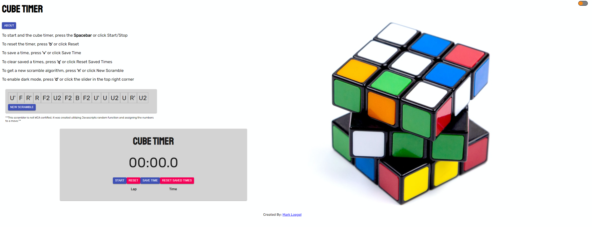
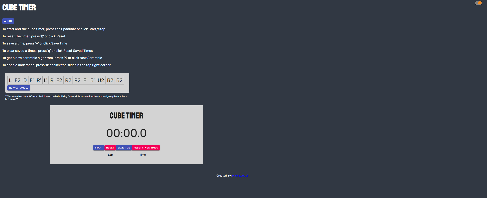
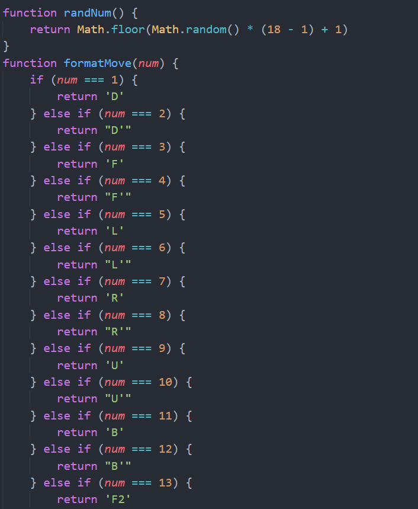
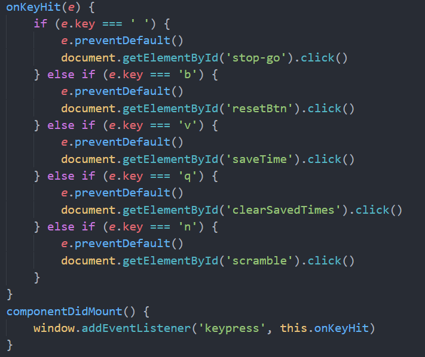
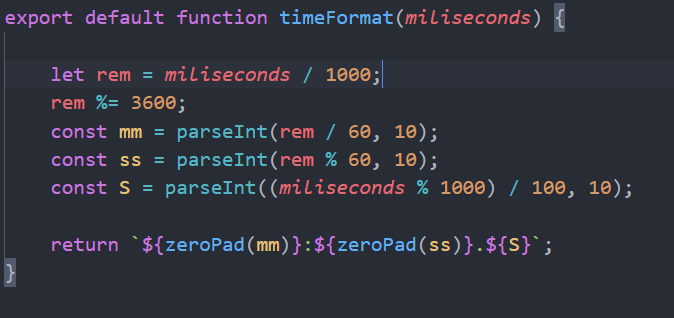

# Cube Timer

## Created By: Mark Loegel

## Deployed Link: https://cube-timer.vercel.app/

## About

This project was created because solving Rubik's cubes and coding are passions of mine. Cube Timer is used for timing and keeping track of your solve times. This project is perfect for cubers because it not only includes a scrambler algorithm or a dark mode for cubing at night, but all of the controls can be done using your keyboard for realistic solve times.

## Technologies Used

-React  
-Sass  
-Material-UI  
-ReactJs-Popus  

## Dark Mode

#### Description: Light mode

#### Description: Dark Mode

## Code Snippets

### Here is part of the scrambler algorithm

### Here is the keyboard controls setup

### Here is the timer format

